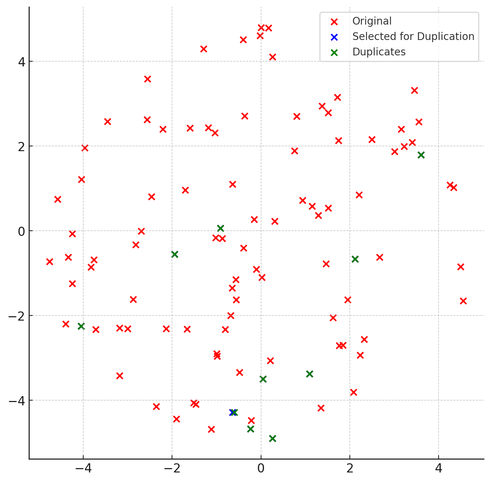
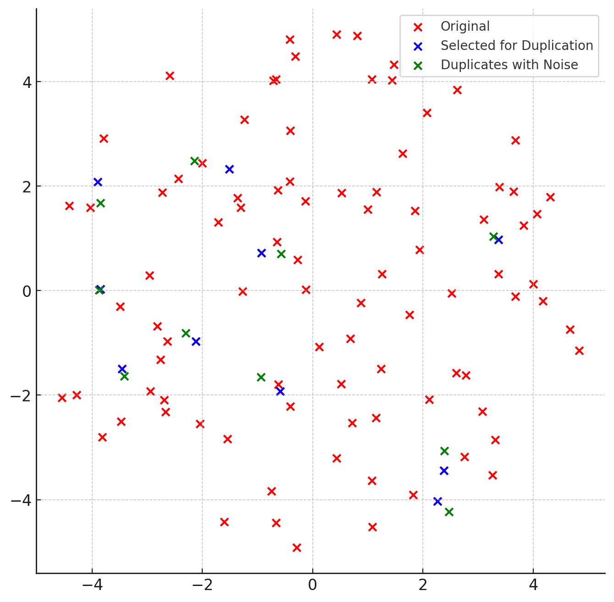
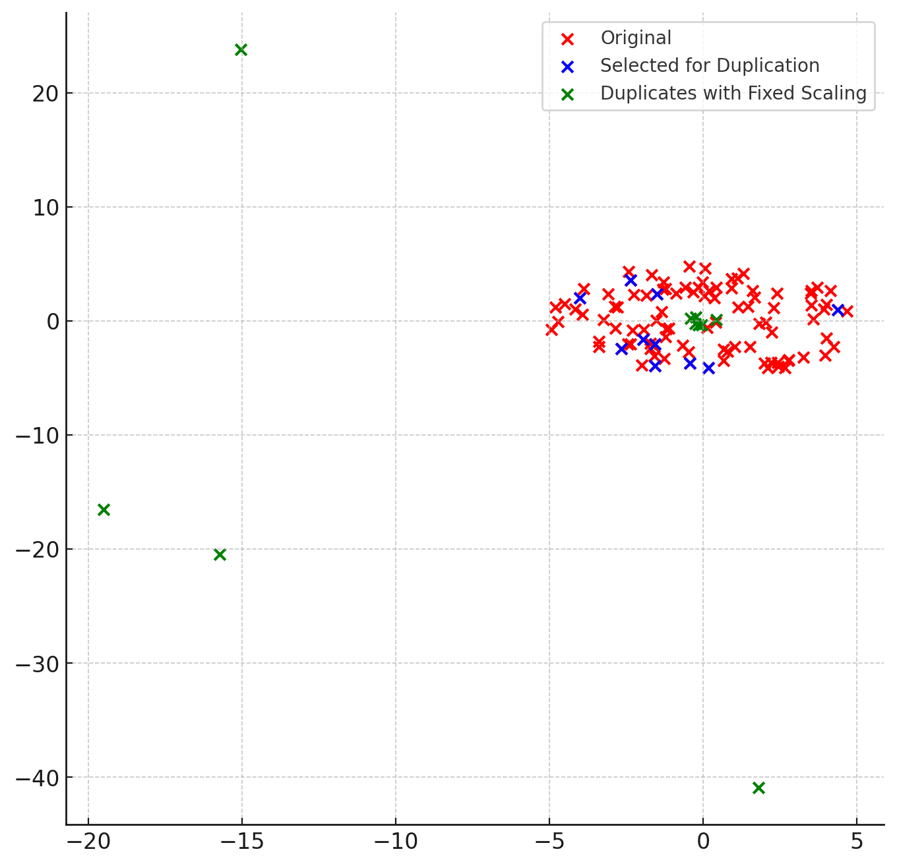
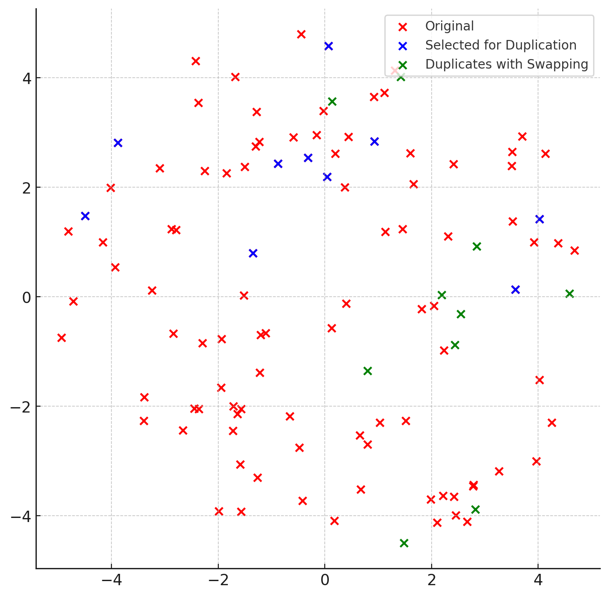
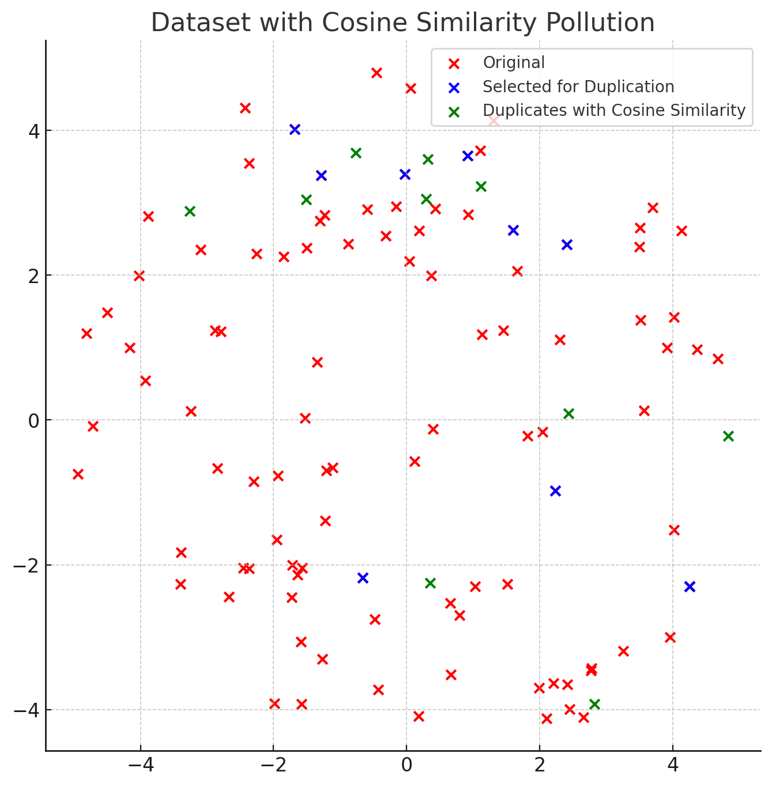
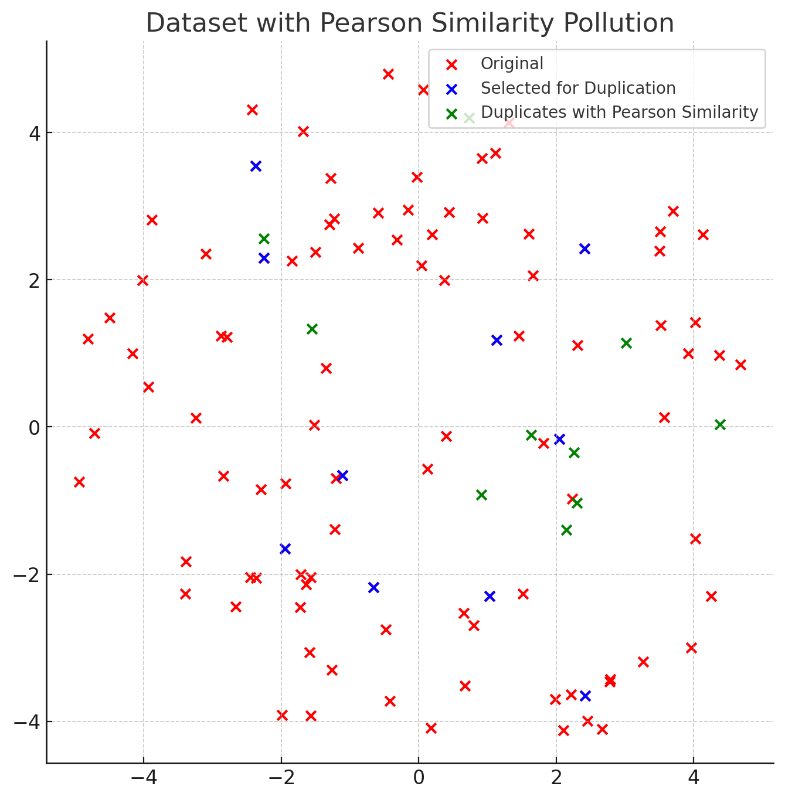
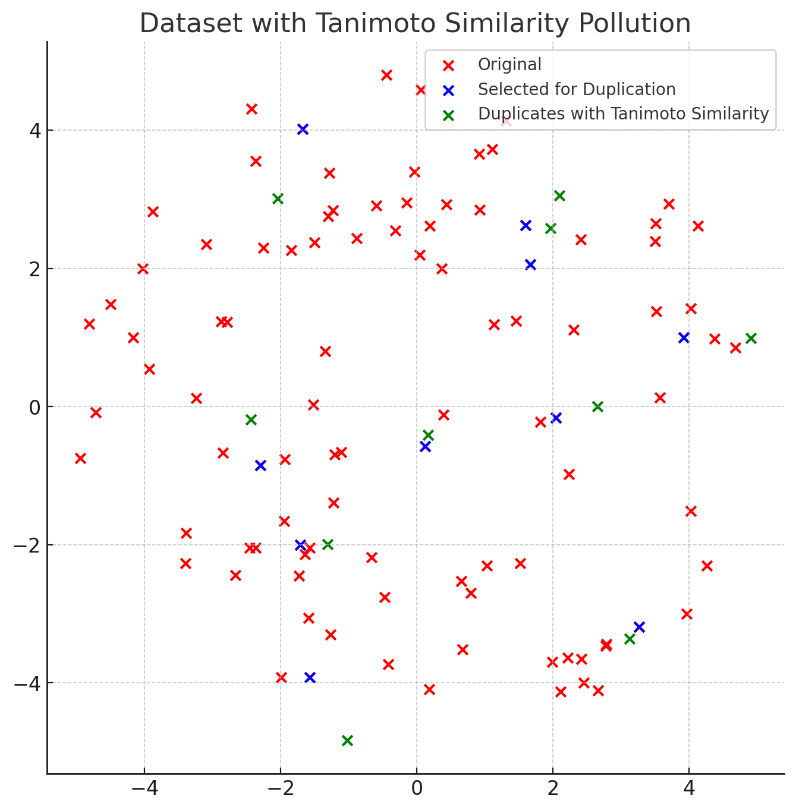

# Data and Information Quality Project - AY 2023/2024

The objective of this project was to test the effects of different types of data pollution on the performance of various Machine Learning algorithms.

Specifically, this project documents the effects of the **Duplication**, and the **Variable types** issues in algorithms for Classification.

## Project Setup

This project unfolds in five steps:
1. Data Collection
2. Data Pollution
3. (Polluted) Data Analysis and Evaluation
4. Data Preparation
5. (Cleaned) Data Analysis and Evaluation

Our task was to design and develop the *pollution* and *preparation* tasks: This process required engineering both the functions to interact with data, and the experiments that could yield the most interesting results in our assigned scenario.

The dataset for this year's projects was a fully numeric, randomly generated dataset using sklearn's `make_classification` function.

## Data Pollution

For this step, we designed pollution functions that would inject non-exact duplicates, and functions that would append new correlated/non-correlated features to all the tuples of the dataset.

> Given the scarce interpretability of our dataset, we designed several pollutions to mimic possible real-world scenarios.

The following is a brief overview of the functions, for a more comprehensive look, please refer to the notebooks, and the report.

### Non-Exact Duplicate Issue
Each of the following functions works on a subset of the dataset: Given a percentage of pollution, they will inject the dataset with the correct number of duplicate data points.
We implemented the following pollution functions:
- **Rounding-off**: Duplicates a data point by shaving off a random amount of digits, for a random amount of features.

	

- **Gaussian Noise**: Duplicates a data point by adding some Gaussian noise to it.

	

- **Scaling**: Duplicates a data point by re-scaling it to a random power of 10, inside a specific interval.

	

- **Swapping**: Duplicates a data point by swapping a random amount of features of that same point.

	

- **Similarity Pollution**: Duplicates a data point by creating another one with a certain level of similarity.

  
  
  

Each of these was created to imitate possible errors, either caused by human insertion (Swapping), or by misconfigurations/miscalibrations/lack of precision of sensors (Rounding-off, Gaussian noise, Scaling, Similarity).

### Variable Types Issue
For this step, we designed pollution functions that would inject *new features* for each tuple of the dataset. The decision of modifying the full dataset was taken to avoid issues related to missing values in steps 3/5.

Our approach to this issue in this scenario was two-fold, as we tried inserting features that were either uncorrelated, or correlated by complex interactions between other pre-existing features.

We designed the pollution functions and the experiments to try and answer the following questions:
1. How impactful is feature variety compared to quantity?
2. Which types of features impact performance the most?
3. Can adding correlated features help models in learning a more effective representation?
4. Which models tend to fit noise, and which models can distinguish relevant features from redundant/irrelevant ones?

The pollution functions implemented are:
- **Boolean Correlated/Non-correlated**
- **String Correlated/Non-correlated**
- **Numeric Correlated/Non-correlated**
- **Date Correlated/Non-correlated**

Each of these injects one new feature of the corresponding type, which is either correlated to the other, pre-existing features, or completely non-correlated.

## Data Preparation

This step was tackled using the **recordlinkage** library for non-exact duplicate detection. Specifically, we defined a similarity threshold above which points were deemed duplicates.

This was tested with various configurations (linear, exp, gauss and squared) and showed an overall good cleaning performance, apart from some pollutions which were practically undetectable without any prior knowledge.

For a more in-depth look at deduplication results, please refer to the report.

This project received an **almost-perfect** grade of 2.5/3, due to the lack of more experiments.
